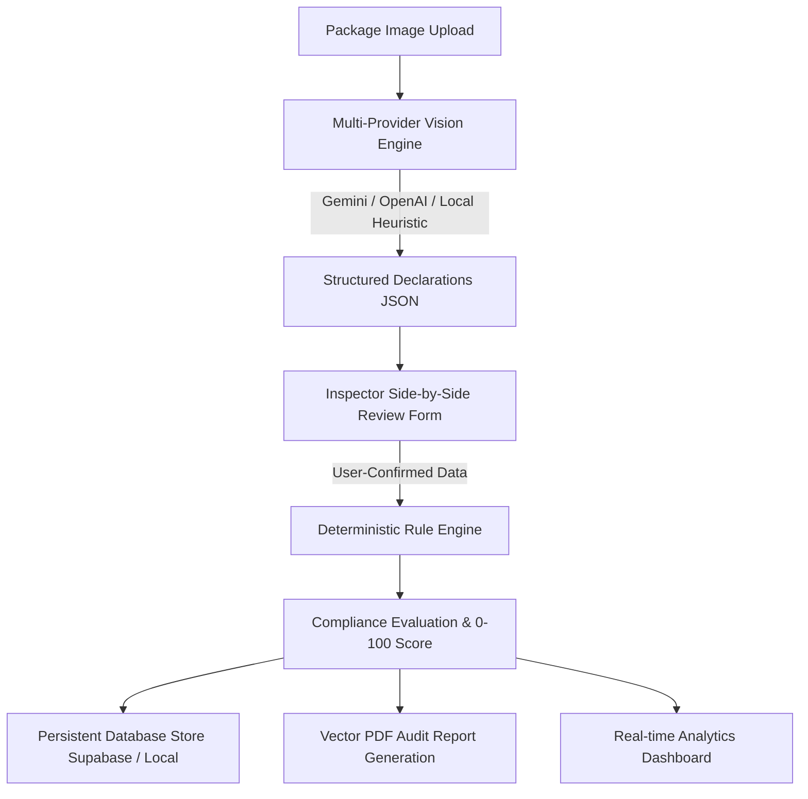

# LegalMetrix – AI-Powered Legal Metrology Packaged Commodity Compliance System

**LegalMetrix** is an automated internal compliance inspection and audit platform built for testing packaged commodities against the **Legal Metrology (Packaged Commodities) Rules, 2011** (and applicable amendments) in India.

---

## ⚖️ Statutory Notice & Prototype Disclaimer

> **IMPORTANT DISCLAIMER:**
> This software is a prototype compliance assessment tool developed for hackathon demonstration and preliminary evaluation purposes. It does not constitute official legal certification or a statutory inspection under the *Legal Metrology Act, 2009*.

---

## 🌟 Key Features & Workflow

1. **Upload Package Label**: Drag-and-drop or select sample package images (PNG, JPG, JPEG, WebP).
2. **AI Vision & Heuristic Extraction**: Multi-provider OCR powered by Google Gemini Vision (`gemini-2.0-flash`), OpenAI Vision (`gpt-4o`), and deterministic local heuristic parser. Missing fields return `"Not detected"` rather than fabricated values.
3. **Side-by-Side Inspector Verification**: Side-by-side view with zoomable label preview on the left and fully editable fields on the right. Compliance checks strictly use the user-confirmed values.
4. **Deterministic Compliance Rule Engine**: Independent TypeScript rule engine implementing 12+ statutory checks from the Indian Legal Metrology Rules 2011.
5. **Transparent Scoring & Violations**: Dynamic 0–100 weighted compliance score with category-level breakdowns and prioritized corrective recommendations.
6. **Persistent Data Storage**: Dual-persistence architecture with Supabase PostgreSQL and automatic local persistent storage.
7. **Official PDF Audit Reports**: Vector PDF generation with inspection metadata, rule findings, severity badges, corrective actions, and legal disclaimers.
8. **Live Real-Time Dashboard**: Automatically computes compliance rates, average scores, category distributions, common violations, and recent inspections from actual database records.
9. **Products Catalog & Audit History**: Track commodities by manufacturer, view historical inspection records, and filter by status and date.
10. **Deterministic Demo Presets**: Includes 3 pre-calibrated sample commodities (Fully Compliant, Partially Compliant, and Non-Compliant) for presentation reliability.

---

## 🏛️ Architecture & Verification Flow



---

## 📋 Implemented Statutory Compliance Rules

The prototype implements configurable checks derived from the *Legal Metrology (Packaged Commodities) Rules, 2011*:

| Rule ID | Statutory Reference | Requirement | Severity | Status |
| :--- | :--- | :--- | :--- | :--- |
| `RULE-NAME-01` | Rule 6(1)(a) | Generic / Common Name of Commodity on Principal Display Panel | Critical | **Implemented** |
| `RULE-NETQTY-01` | Rule 6(1)(b), 12, 13 | Net Quantity in Standard Metric Units (Prohibits 'approx', 'when packed') | Critical | **Implemented** |
| `RULE-MRP-01` | Rule 6(1)(e) | Maximum Retail Price (MRP) in ₹ inclusive of all taxes | Critical | **Implemented** |
| `RULE-USP-01` | Rule 6(1)(f) (2021) | Unit Sale Price (USP) per g/ml/piece for packages >1kg/1L | Minor | **Implemented** |
| `RULE-MFG-01` | Rule 6(1)(d) | Complete Name & Postal Address of Manufacturer/Packer with PIN Code | Critical | **Implemented** |
| `RULE-CC-01` | Rule 6(1)(n) | Consumer Care Cell with Telephone/Toll-Free, Email, and Address | Major | **Implemented** |
| `RULE-COO-01` | Rule 6(10) / 6(1)(m) | Country of Origin Declaration (e.g. 'Made in India') | Major | **Implemented** |
| `RULE-DATE-01` | Rule 6(1)(c)/(d) | Month & Year of Manufacture / Pre-packing / Import (MM/YYYY) | Critical | **Implemented** |
| `RULE-BATCH-01` | Rule 6(1)(g) | Batch Number / Lot Code for Traceability | Major | **Implemented** |
| `RULE-IMP-01` | Rule 6(1)(d) & Rule 23 | Name and Address of Importer (for imported commodities) | Critical | **Implemented** |
| `RULE-EXP-01` | Rule 6(1)(d) Proviso | Best Before / Expiry Date (Food & Perishable commodities) | Critical | **Implemented** |
| `RULE-VEG-01` | FSSAI & Rule 6 | Vegetarian (Green) / Non-Vegetarian Emblem for Food items | Major | **Implemented** |

---

## 🚀 Setup & Local Development

### 1. Prerequisites
- **Node.js**: v18.0.0 or higher (v20+ recommended)
- **npm** or **yarn** / **pnpm**

### 2. Installation
```bash
# Navigate to the project directory
cd legalmetrix

# Install dependencies
npm install
```

### 3. Environment Configuration
Copy `.env.example` to `.env.local`:
```bash
cp .env.example .env.local
```

Configure your environment variables:
```env
# Vision AI APIs (Optional: Built-in demo presets & local parsers work without keys)
GEMINI_API_KEY=your_gemini_api_key_here
OPENAI_API_KEY=your_openai_api_key_here

# Supabase PostgreSQL (Optional: Automatically uses persistent local storage if blank)
NEXT_PUBLIC_SUPABASE_URL=
NEXT_PUBLIC_SUPABASE_ANON_KEY=
SUPABASE_SERVICE_ROLE_KEY=
```

### 4. Running the Development Server
```bash
npm run dev
```

Open [http://localhost:3000](http://localhost:3000) in your browser.

---

## 🗄️ Database Setup (Supabase / PostgreSQL)

If deploying with Supabase:
1. Create a new Supabase project at [https://supabase.com](https://supabase.com).
2. Go to the **SQL Editor** in your Supabase dashboard.
3. Run the complete SQL migration script located at:
   ```
   supabase/migrations/20260828_init_legalmetrix.sql
   ```
4. Copy your project URL and service role key into `.env.local`.

---

## 🧪 Automated Testing

Run the test suite:
```bash
npm test
```

---

## 📊 Feature Status: Implemented vs. Future Enhancements

### Implemented
- [x] Next.js 15 + React 19 + TypeScript + Tailwind CSS full-stack architecture.
- [x] Multi-provider Vision AI extraction (Gemini 2.0 Flash + OpenAI + Local Parser).
- [x] Side-by-side inspector review and field editing with raw OCR audit trail.
- [x] Deterministic 12-point Legal Metrology rule engine with conditional category logic.
- [x] Weighted 0–100 compliance scoring with transparent penalty calculation.
- [x] PDF compliance audit report generation with vector layout and statutory disclaimer.
- [x] Live dashboard computed from real database records.
- [x] Inspection history with real-time search, category/status filters, and score sorting.
- [x] Products catalog grouping inspections by commodity brand.
- [x] Configurable rules engine allowing live toggling of individual statutory checks.
- [x] 3 Deterministic pre-calibrated demo packages (100% Compliant, Partial Pass, Non-Compliant).
- [x] Dual-persistence adapter (Supabase PostgreSQL + local persistent JSON storage).

### Future Enhancements
- [ ] Mobile camera barcode/QR code live scanning for automated MRP cross-referencing.
- [ ] Multi-lingual OCR support for regional Indian state languages (Hindi, Tamil, Marathi, Bengali).
- [ ] Direct integration with National Consumer Helpline (NCH) and e-Daakhil grievance portals.
- [ ] Continuous batch monitoring for high-throughput automated packaging conveyor lines.
